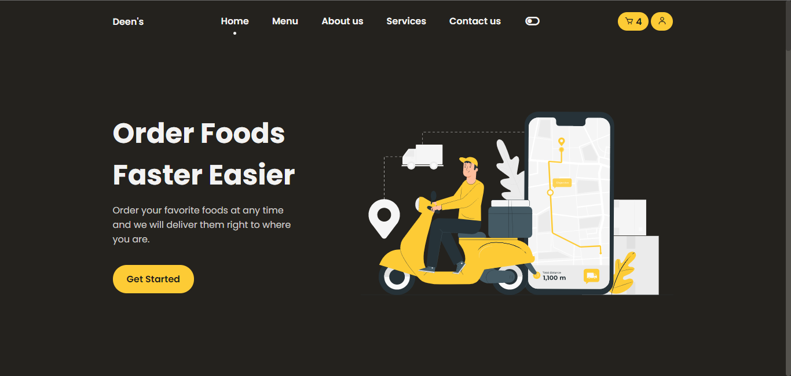
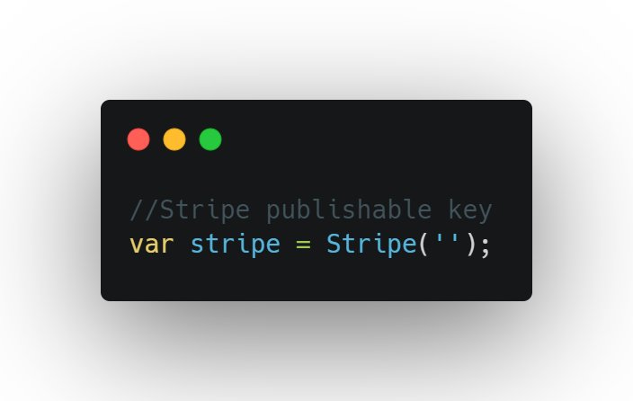

# foodDelivery
This is a food ordering and restaurant management web application developed using mongoDB,expressJS and some other libraries.

# Features
- Customers can be able to make orders via online.
- Customers are able to choose the delivery methods.
- Customers are able to write  reviews and ratings for the food via online.
- Customers are able to login and register to the system.
- Customers can be able to track order status.

- Cashiers can provide customer support via online.
- Cashiers can be able to track orders using the system.
- Cashiers can be able to manage orders using the system.

- Admin can be able to provide real time offers for their customers.
- Admin can be able to generate business analytics and reports using the system.
- Admin can be able to control the whole system using the admin dashboard.
- Admin can be able to manage restaurants using the system.
 

# Installation
In this application i used stripe for payments feature in order to use this app, 

1. Clone the project

2. Create a .env file in the root

3. Include required environment variables to the .env file as follows,

4. Add the stripe publishable key in the file that is located on /public/js/stripe.js as follows,

# Acknowledgement
Front-end is inspired by a youtube video at https://youtu.be/xOQU3YNHxJc
