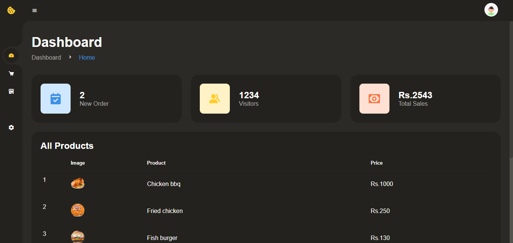
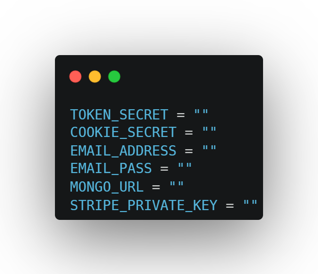

# foodDelivery 
This is a web-based system that allows online food ordering and restaurant management. developed using mongoDB,expressJS and some other libraries.

# Features
- Customers can make orders via online.
- Customers can choose the delivery methods.
- Customers can write  reviews and ratings for the food via online.
- Customers can login and register to the system.
- Customers can track order status.

- Cashiers can provide customer support via online.
- Cashiers can track orders using the system.
- Cashiers can manage orders using the system.

- Admin can provide real time offers for their customers.
- Admin can generate business analytics and reports using the system.
- Admin can control the whole system using the admin dashboard.
- Admin can manage restaurants using the system.
 

# Installation
This system has a online payment feature which has been built using stripe so in order to use this , 

1. Clone the project

2. Create a .env file in the root

3. Include required environment variables to the .env file as follows,

4. Add the stripe publishable key in the file that is located on /public/js/stripe.js as follows,

# Acknowledgement
Front-end is inspired by a youtube video at https://youtu.be/xOQU3YNHxJc
